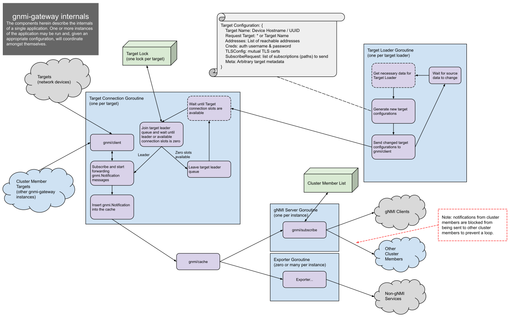

# gnmi-gateway

## Overview
Currently there are a few open source services[\[1\]](#Appendix) available
to consume and distribute OpenConfig modeled gNMI streaming telemetry data
however none of them are currently built for horizontal scalability or
high availability. Additionally these services are not gNMI-first and
don’t consider the need for _Get_ and _Set_ RPCs along with the _Subscribe_ RPC.
In order to fill-in these gaps we are building a service, **gnmi-gateway**,
that will act as an intermediary gateway for consumers utilizing gNMI RPCs.

Initially we plan to focus on the gNMI _Subscribe_ RPC functionality but plan to
eventually include functionality for gNMI _Get_ and _Set_ RPCs. In addition to
supporting consumers that utilize the gNMI _Subscribe_ RPC the gnmi-gateway
will initially include various exporters to expose non-gNMI interfaces for
the OpenConfig data or to integrate with OpenConfig-unaware systems
(e.g. Prometheus, InfluxDB, Netbox, etc).

## Goals
We want to build a service that will provide horizontal scalability for 1000s
of target connections distributed across multiple gateway instances while
ensuring high availability of these connections for gNMI consumers.

As a secondary goal we want to increase community use and support of OpenConfig
and gNMI. We plan to encourage the use of gnmi-gateway within the networking
community and plan to provide multiple integrations for common and popular
OpenConfig-unaware systems in order to help drive the integration of gNMI
in various networks.

## Details

### Gateway Components
Reference implementation components for gNMI have been published in the public
repo: https://github.com/openconfig/gnmi. We will utilize as much of this
code as possible in order to reduce the amount of duplicate code and duplicate
effort. The pieces for the gnmi-gateway that we’ll have to implement outside of
the available gNMI code are:
- Target configuration from external data, for example: from Netbox or
  configuration files. 
- High availability, connection load distribution, and
  data aggregation (clustering)
- Exporters

### Connection Components
Within the openconfig/gnmi repo there are 3 components we plan to directly
utilize:
- **gnmi/client** -- a fault-tolerant connection manager for gNMI
- **gnmi/cache** & **gnmi/subscribe** -- libraries for aggregating gNMI
  messages from multiple clients and serving them in a single stream

The system will maintain a lock for each connection which will be used for
inter-instance signaling to provide high-availability for the gNMI target
connections. By default the system will use Zookeeper for this locking
mechanism.

### Target Configuration Components
To facilitate the modularization of target configuration the gnmi-gateway will
include target loaders to extend target configuration functionality.
Target loaders will allow targets to be updated dynamically after gnmi-gateway
start-up. The target loaders we plan to include with our initial release are:
 - Watched file
 - Netbox

### Exporter Components
We plan to initially include a few exporters to allow the integration of gNMI
data into other systems that don’t support OpenConfig or gNMI directly. Some
external systems for which we are planning exporter integrations are:
- Prometheus
- Atlas
- Kafka
- Elasticsearch

### Other Components
We also plan to include a ready-to-use Dockerfile that will allow easy testing
of the gnmi-gateway against real network targets and show-off various exporters
that are included. This will likely include some appealing visualizations and
dashboards.

### Diagram

\[[diagram source][5]]

## Appendix
\[1] Existing gNMI streaming telemetry consumer services
- [gnmi_collector][1]
- [gNMI plugin for Telegraf][2]
- [Panoptes][3]
- [Cisco Big Muddy][4]

[1]: https://github.com/openconfig/gnmi/blob/master/cmd/gnmi_collector
[2]: https://github.com/influxdata/telegraf/tree/master/plugins/inputs/gnmi
[3]: https://github.com/yahoo/panoptes
[4]: https://github.com/cisco/bigmuddy-network-telemetry-pipeline
[5]: https://docs.google.com/drawings/d/19UveHFMGCLwX5z3KnV46mkpkiqPk849VuuHdS_XFUyM/edit?usp=sharing
